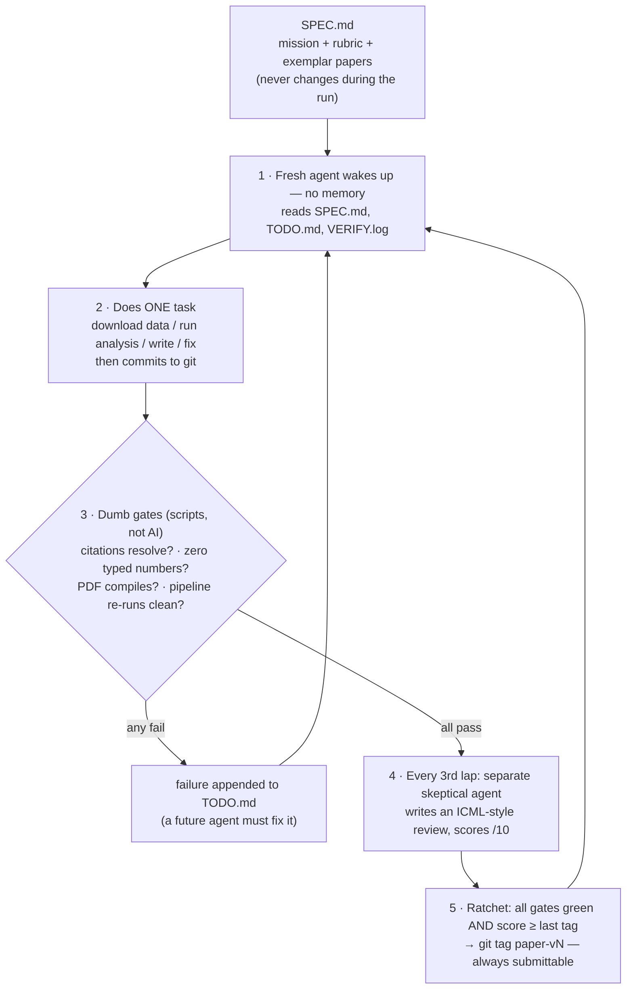
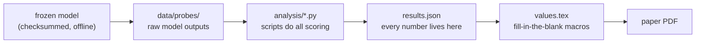

# Ralph Scientist

An unattended agent loop (Ralphthon @ICML 2026, Track 1) that writes a real research paper
where **every citation resolves and every number is compiled from experiments in this repo**.
Fabrication isn't discouraged — it's structurally impossible.

The design in one breath: **the writer is creative and untrusted, the gates are dumb and
incorruptible, the reviewer is skeptical.**

## The loop



## What happens when a gate fails

The agent that caused a failure never sees it — it has already exited by the time gates run.
The **next** agent inherits the fix:

```
 lap 7:  agent adds a citation that turns out to be fake → commits → exits
         harness runs gates → citation gate FAILS
         → failure written into TODO.md and VERIFY.log
 lap 8:  brand-new agent reads TODO.md + VERIFY.log first
         → PROMPT.md rule: "gate failures take priority over new work"
         → fixes the citation → commits → gates go green → loop continues
```

A failure can't be ignored, for two reasons:

1. **Priority rule** — PROMPT.md orders every agent to handle gate failures before new work.
2. **The ratchet is a wall** — gates re-run every lap, and while any gate is red, no new
   version can be tagged. The loop physically cannot make official progress past a failure.

Mental model: the agents are **shift workers at a factory who never meet**. Each clocks in,
reads the shared logbook (TODO.md) and the inspection report (VERIFY.log), does one job,
clocks out. The inspector only comes through between shifts — whoever broke something is
gone by the time it's found, and the next shift's first duty is the fix. This is a feature:
the fresh agent has no memory of the mistake and no urge to defend its own bad approach.
Fresh eyes every lap.

(Known edge case: a genuinely hard failure could repeat for several laps. Planned upgrade —
the harness counts consecutive fails of the same gate and escalates the TODO message to
"stop retrying the same fix, try a different approach.")

## Why the numbers can't be fake



The agent may not type digits into the paper — a gate greps the LaTeX source and fails the
iteration if it finds any. The only road a number can travel is the one above. Before any
version is tagged, the harness deletes `results.json` and re-runs the whole pipeline: if the
same numbers come back, they were real.

## Build status

| Component | Status |
|---|---|
| Architecture + decision log (`PLAN.md`) | ✅ done |
| Agent constitution (`SPEC.md`, `PROMPT.md`) — topic re-locked 2026-07-04 (context degradation) | ✅ done |
| Frozen model (Qwen2.5-0.5B-Instruct Q8, sha256 + FETCH.sh; determinism spike passed) | ✅ done |
| Frozen dataset (NLSY97, 71 vars × 8,984, checksummed + tagset) — now fallback #1 | ✅ done |
| Citation gate — live-tested vs Crossref, 3 exemplars verified | ✅ working |
| Number-literal gate — tested, dimension false-positives fixed | ✅ working |
| Sanity gate + results.json contract (`analysis/RESULTS_SCHEMA.md`) | ✅ working |
| Gate runner (`run_gates.sh`) — subshell exit bug found+fixed in testing | ✅ working |
| Makefile, venv (pinned), tectonic, ICML 2026 template compiling | ✅ working |
| Codex CLI unattended mode (`codex exec -s workspace-write`) | ✅ verified |
| Loop + ratchet — 3-lap micro-run: all gates green, real paper produced | ✅ working |
| Sabotage suite: 5 attacks (fake cite, typed number, macro tamper, gate tamper, overclaiming) | ✅ all caught |
| Reviewer calibration — honest 4/10 vs sabotaged 2/10 (`harness/calibration/`) | ✅ done |
| Endurance run: 9 effective laps, 12/12 gates green, 12 shadow tags, analysis 18→76 values | ✅ done |
| Quota-outage behavior: degraded gracefully; backoff + review-pointer added to loop | ✅ fixed |
| Reviewer trajectory 4→5→4 (deeper analysis exposed real fragility — reviewer caught it) | 📈 in progress |
| Dress rehearsal (full-day, on refreshed quota) + paper-v1 tag | ❌ Jul 7–9 |
