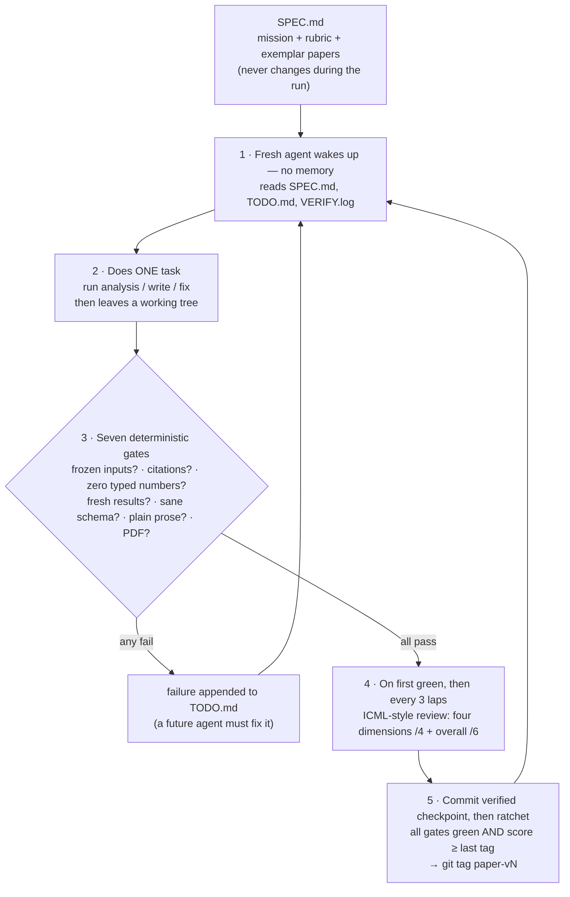
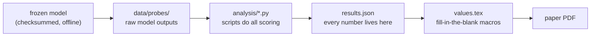

# Ralph Scientist

An unattended agent loop (Ralphthon @ICML 2026, Track 1) that writes a real research paper
where **every citation resolves and every reported result number is compiled from experiments
in this repo**.
The system makes fabrication difficult, visible, and reproducible enough to audit.

The design in one breath: **the writer is creative and untrusted, protected checks are
deterministic, and the reviewer is skeptical.**

## The loop



## What happens when a gate fails

The agent that caused a failure never sees it — it has already exited by the time gates run.
The **next** agent inherits the fix:

```
 lap 7:  agent adds a citation that turns out to be fake → exits
         harness runs gates → citation gate FAILS
         → failure written into TODO.md and VERIFY.log
 lap 8:  brand-new agent reads TODO.md + VERIFY.log first
         → PROMPT.md rule: "gate failures take priority over new work"
         → fixes the citation → commits → gates go green → loop continues
```

A failure can't be ignored, for two reasons:

1. **Priority rule** — PROMPT.md orders every agent to handle gate failures before new work.
2. **The ratchet is a wall** — gates re-run every lap, and while any gate is red, no new
   version can be tagged. The loop physically cannot make official progress past a failure.

Mental model: the agents are **shift workers at a factory who never meet**. Each clocks in,
reads the shared logbook (TODO.md) and the inspection report (VERIFY.log), does one job,
clocks out. The inspector only comes through between shifts — whoever broke something is
gone by the time it's found, and the next shift's first duty is the fix. This is a feature:
the fresh agent has no memory of the mistake and no urge to defend its own bad approach.
Fresh eyes every lap.

(Known edge case: a genuinely hard failure could repeat for several laps. Planned upgrade —
the harness counts consecutive fails of the same gate and escalates the TODO message to
"stop retrying the same fix, try a different approach.")

## How numeric provenance is checked



Except for publication years, the agent may not type numeric literals into the paper. Every
other number must pass through `results.json` and generated LaTeX macros. Every lap verifies
the frozen model checksum and regenerates scoring plus macros from cached raw outputs before
the PDF is compiled. Before submission, `make clean-deep && make all` deletes the raw outputs
and repeats inference. The analysis code and raw artifacts remain public for inspection; the
harness proves reproducibility and traceability, while scientific correctness still depends
on review of the experiment design and scoring code.

## Build status

| Component | Status |
|---|---|
| Architecture + decision log (`PLAN.md`) | ✅ done |
| Agent constitution (`SPEC.md`, `PROMPT.md`) — topic re-locked 2026-07-04 (context degradation) | ✅ done |
| Frozen model (Qwen2.5-0.5B-Instruct Q8, sha256 + FETCH.sh; determinism spike passed) | ✅ done |
| Frozen dataset (NLSY97, 71 vars × 8,984, checksummed + tagset) — now fallback #1 | ✅ done |
| Frozen-input gate — model and fallback-data SHA-256 manifests | ✅ working |
| Citation gate — 11 current bibliography entries cached and verified | ✅ working |
| Number-literal gate — all numeric literals except publication years rejected | ✅ working |
| Sanity gate + results.json contract (`analysis/RESULTS_SCHEMA.md`) | ✅ working |
| Gate runner (`run_gates.sh`) — subshell exit bug found+fixed in testing | ✅ working |
| Makefile, venv (pinned), tectonic, ICML 2026 template compiling | ✅ working |
| Codex CLI unattended mode (`codex exec -s workspace-write`) | ✅ verified |
| Loop + ratchet — checkpoint-before-tag ordering covered by regression test | ✅ fixed |
| Sabotage suite: 5 attacks (fake cite, typed number, macro tamper, gate tamper, overclaiming) | ✅ all caught |
| Reviewer calibration — honest 4/10 vs sabotaged 2/10 (`harness/calibration/`) | ✅ done |
| Endurance run: 9 effective laps, 12/12 gates green, 12 shadow tags, analysis 18→76 values | ✅ done |
| Quota-outage behavior: degraded gracefully; backoff + review-pointer added to loop | ✅ fixed |
| Latest context-paper review — legacy rubric 6/7 but legacy overall 3/10 reject | ⚠️ design lessons folded into seed |
| Dress rehearsal — context paper through paper-v13, independent review + confirmation | ✅ done |
